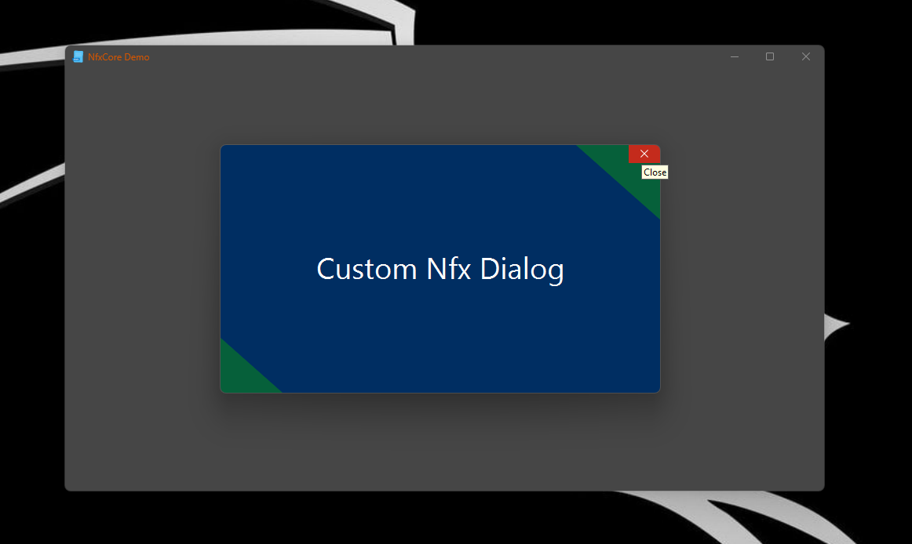

# nfx-core for Windows

nfx-core is a JavaFx/JNI library designed exclusively for Windows (Tested on Windows 11). It enhances your Java applications by allowing advanced manipulation of the Stage's title bar and custom decorations.

## Features

- **Native Behavior**: Ensures that the window behaviors align with standard Windows interactions.
- **Native Snap Layout**: Supports Windows 11 snap layouts. On Windows 10, it defaults to the native tooltip system.
- **Native Tooltips**: Utilize Windows' built-in tooltips for a consistent look and feel.
- **Full Customization**: All decoration elements can be fully customized from the JavaFX side.
- **Easy Theme Creation**: Facilitates the creation of custom themes.
- **Caption Color Customization**: Easily set the caption color for `NfxWindow` instances using methods like:
  ```java
  setCaptionColor("#D35400");
  setCaptionColor(Color.RED);
  ```
- **Additional Features**: Includes more enhancements and functionalities to explore.

## Examples

Check out our interactive examples to see `nfx-core` in action:

- [Demo Application Code](demo/src/main/java/xss/it/demo/Demo.java)

## Screenshots

Here are some visual examples of what `nfx-core` can do:

1. **NfxWindow Example**  
   

2. **Custom Window**  
   Extending from `AbstractNfxUndecoratedWindow`  
   

3. **Custom Dialog**  
   Demonstrates a custom dialog that can be hidden or shown in the taskbar  
   

For more examples and in-depth usage, check out our demo.

## Important Note

To ensure efficient support, please provide a minimal reproducible code example when reporting issues. We focus on issues that include such code to help diagnose and address concerns effectively.
