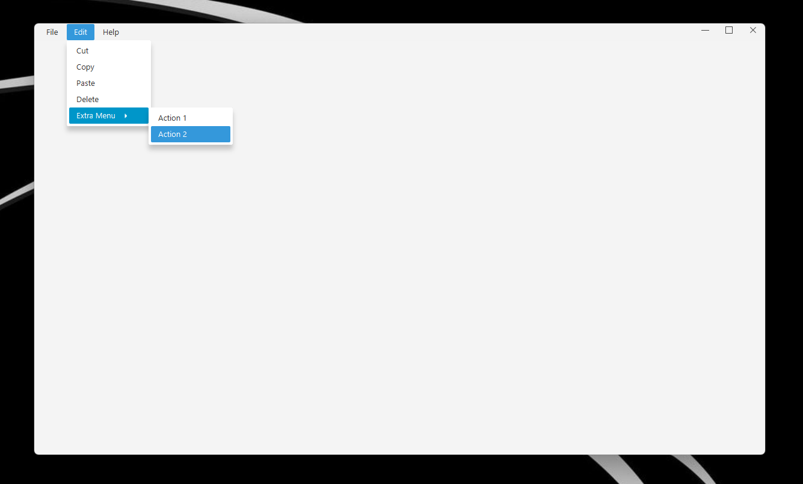

# nfx-core for Windows

**nfx-core v 1.0.3** is a JavaFX/JNI library for Windows 10/11 (validated on Windows 11) that lets you build fully custom, native‑feeling window chrome: title bar, buttons, and frame behavior.

## Requirements
- Windows **10 or later**
- JavaFX 21+
- Per‑monitor DPI awareness (PMv2) recommended

## Features

- **Native behavior**
    - Correct non‑client hit testing; system menu, move/resize, and drag zones behave like real Windows windows.
- **Windows 11 Snap Layouts**
    - Full snap‑layout support on Win11; automatic native tooltips fallback on Win10.
- **Native tooltips**
    - Uses Windows tooltips for a consistent look & feel.
- **Full customization from JavaFX**
    - All decoration elements are styled and controlled from the FX side.
- **Easy theming**
    - New CSS pseudo‑classes for window controls make styling trivial.
- **Caption color**
  ```java
  setCaptionColor("#D35400");
  setCaptionColor(Color.RED);
  ```
- **New: `NfxStage` (abstract base)**
    - High‑performance hit testing via cached `HitSpot`s (map‑backed), immutable snapshots, and per‑control wiring (close / maximize / minimize).
    - Per‑Region client‑area spots with automatic `:ht-client` pseudo toggling for CSS.

## `NfxStage` in a nutshell

- API surface:
    - `addClientAreas(Region...)` / `removeClientAreas(Region...)`
    - `setCloseControl(Control)` / `setMaxControl(Control)` / `setMinControl(Control)`
    - `protected double getTitleBarHeight()` (return DIP)
- Internals (you don’t have to touch these):
    - Identity‑based cache: `Map<Region, HitSpot>` so each Region has **one** `HitSpot` (no listener churn).
    - Immutable snapshot list for `getHitSpots()`; rebuilt only when inputs change.
    - `:ht-client`, `:ht-close`, `:ht-max`, `:ht-min` pseudo‑classes are toggled automatically during hit‑testing.

### Minimal usage

```java
public final class MyWindow extends NfxStage implements Initializable {
  @FXML private Button closeBtn, maxBtn, minBtn;
  @FXML private SVGPath maxShape;

  @Override protected double getTitleBarHeight() { return 40; }

  @Override public void initialize(URL u, ResourceBundle r) {
    addClientAreas(titleBar);
    setCloseControl(closeBtn);
    setMaxControl(maxBtn);
    setMinControl(minBtn);
    // Style classes on buttons/graphics for CSS hooks
    closeBtn.getStyleClass().add("hit-btn");
    maxBtn.getStyleClass().add("hit-btn");
    minBtn.getStyleClass().add("hit-btn");
    if (maxShape != null) maxShape.getStyleClass().add("shape");
  }
}
```

## Styling the window buttons

Use the custom pseudo‑classes emitted by `NfxStage` + `HitSpot` to drive your styles.

```css
/* Close button background on hover/active */
.close:ht-close {
  -fx-background-color: #C42B1C;
}

/* Close button icon (e.g., SVGPath with style class 'shape') */
.close:ht-close > .shape {
  -fx-fill: white;
}

/* Minimize / Maximize hover cues */
.hit-btn:ht-min,
.hit-btn:ht-max {
  -fx-background-color: rgba(150,150,150,0.32);
}
```

See the bundled `nfx-window.css` for a ready‑to‑use stylesheet.

## Native / Rendering updates

- **Per‑monitor DPI correctness**
    - Native converts px↔DIP using `GetDpiForWindow`. Java callbacks receive **DIP**.
- **Hit‑test pipeline**
    - `WM_NCHITTEST` collects screen→client px, converts to DIP, calls Java `jniHitTest(xDip, yDip, isOnResizeBorder)`.
    - Spots win over the top resize strip inside the title bar; 1–2 DIP inflation on edges avoids “rim” misses.
- **No listener churn**
    - Map‑backed `HitSpot` cache per Region/Control; immutable snapshot for hot‑path reads.
- **JNI robustness**
    - Thread attach pattern via `JniAttachGuard` (attach if needed; detach only if attached here). Exception checks cleared.

## Examples

See `demo/src/main/java/xss/it/demo/Demo.java` for an interactive demo.

## Screenshots

1. **NfxWindow Example**  
   

2. **Custom Window**  
   Extending from `AbstractNfxUndecoratedWindow`  
   

3. **Custom Dialog**  
   Demonstrates a custom dialog that can be hidden or shown in the taskbar  
   

4. **Custom Dialog**  
   MenuWindow Demo  
   

## Important Note

To ensure efficient support, please provide a minimal reproducible code example when reporting issues. We prioritize issues that include such code to help diagnose and address concerns effectively.
